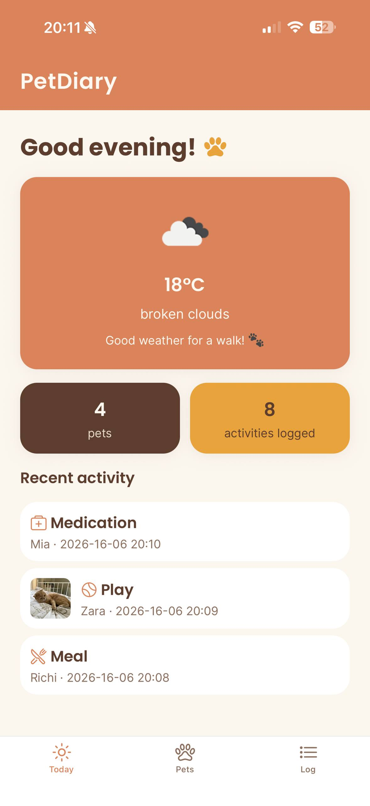
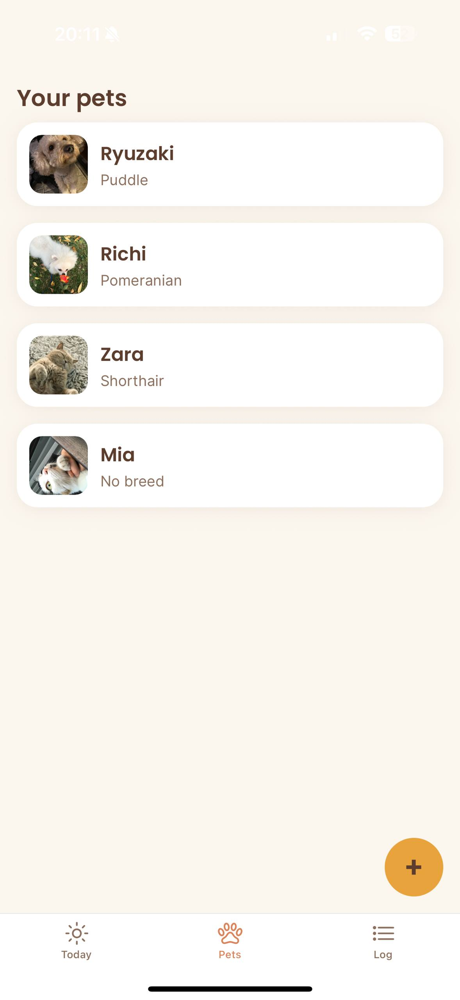
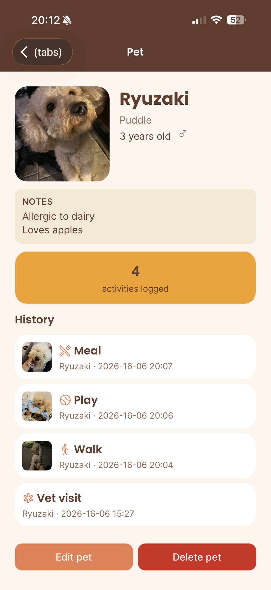
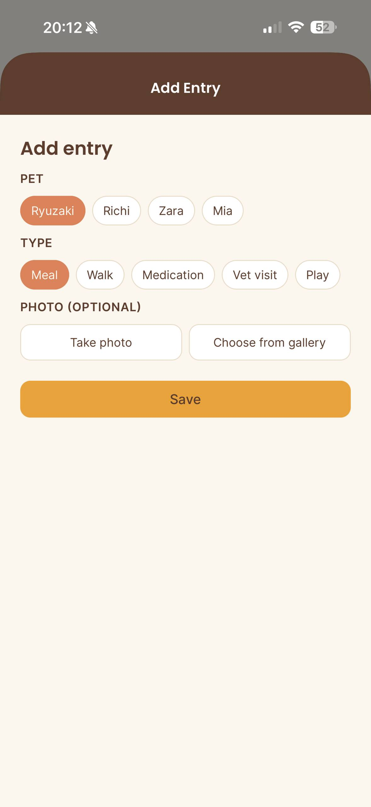
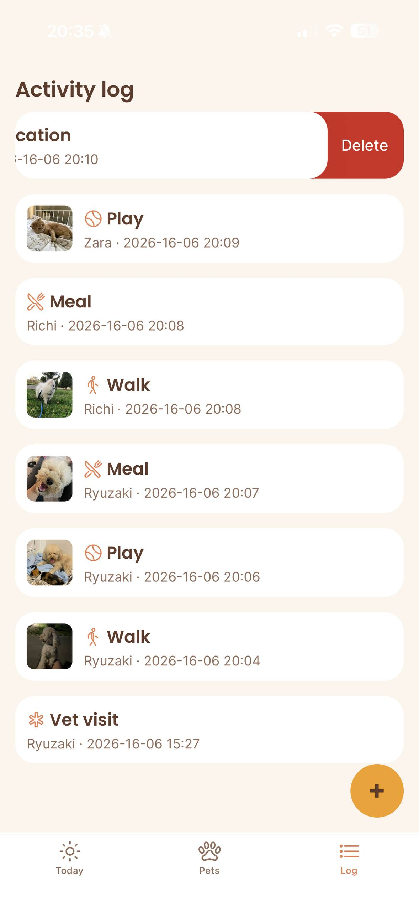

# PetDiary 🐾

A small, offline-friendly journal for your pets. You can add your pets, then document their
daily care: meals, walks, medications, vet visits, and playtime, each with a photo and a
note. You can also check the live local weather in the Today screen, so you know whether it's a
good moment for a walk, plus a quick snapshot of your pets and recent activity.

> Built for the React Native (Expo) laboratory project. Single-user, all data
> stored locally on the device.

## Features

- Add, edit, and delete pets - name, breed, age, gender, notes, and a photo
- Log activities per pet (meal, walk, medication, vet visit, play) with an
  optional photo and note
- Swipe-to-delete on log entries, with haptic feedback on save/delete
- A Today dashboard: live weather, pet/entry counts, and recent activity
- Works fully offline - all data is cached locally and available without
  internet
- Smooth entrance animations and tactile button feedback throughout

## Tech stack

- **Expo** (SDK 54) + **React Native** + **TypeScript**
- **Expo Router** — file-based navigation (tabs + stack + modals)
- **Context API** — global state for pets and activities
- **AsyncStorage** — local persistence
- **expo-image-picker** + **expo-file-system** — camera & gallery photos
- **expo-location** — geolocation for weather
- **expo-haptics** — tactile feedback on key actions
- **react-native-reanimated** + **react-native-gesture-handler** — animations
  and swipe-to-delete
- **OpenWeatherMap** — live weather on the Today screen
- **Jest** + **React Native Testing Library** — unit and integration tests
- **ESLint** + **Prettier** — code quality and formatting

## Project structure

```
app/ Expo Router screens (file = route)
(tabs)/ Today, Pets, Log tab screens
pet/[id].tsx Pet detail screen
add-pet.tsx Add pet (modal)
edit-pet.tsx Edit pet (modal)
add-entry.tsx Add activity entry (modal)
components/ Reusable UI (PetCard, ActivityCard, AnimatedButton)
constants/ Design tokens (theme.ts)
context/ PetContext — global state + AsyncStorage persistence
types/ Pet and Activity type definitions
utils/ Weather API, image saving, greeting helper
assets/ App icon, splash screen, images
```

## Getting started

You'll need [Node.js](https://nodejs.org/) (LTS) and the **Expo Go** app on
your phone.

```bash
# 1. Install dependencies
npm install

# 2. Add your environment file
cp .env.example .env
# then open .env and paste in a free OpenWeatherMap API key
# (get one at https://openweathermap.org/api)

# 3. Start the dev server
npx expo start
```

Scan the QR code with Expo Go (Android) or the Camera app (iOS) to open it.

## Testing

```bash
npm test
```

14 tests cover:

- Activity label data,
- Full pet/activity CRUD lifecycle in `PetContext` (including cascading delete of a pet's activities)
- Time-based greeting logic
- Error handling in the weather and image-saving utilities.

## Native features used

- **Camera & photo gallery** (`expo-image-picker`) - attach photos to pets
  and activity entries
- **Geolocation** (`expo-location`) - used to fetch local weather
- **Haptics** (`expo-haptics`) - feedback on save, delete, and selection
- **On-device storage** (`AsyncStorage`) - all app data persists locally

## Extended criteria implemented

- **C — External API integration**: live weather from OpenWeatherMap, tied
  directly to the app's purpose (deciding whether it's good weather for a
  walk)
- **D — Advanced UX**: entrance animations and swipe-to-delete gestures
  (Reanimated + Gesture Handler), plus haptic feedback throughout

## Building

A production-ready build can be created with EAS Build:

```bash
eas build --platform android --profile preview
```

## Screenshots

**Today** - live weather and a quick snapshot of your pets and recent activity


**Pets** - your pets at a glance


**Pet detail** - full profile, activity history, edit and delete


**Add entry** - log a new activity with a photo


**Delete entry** - delete an activity with swiping gesture

